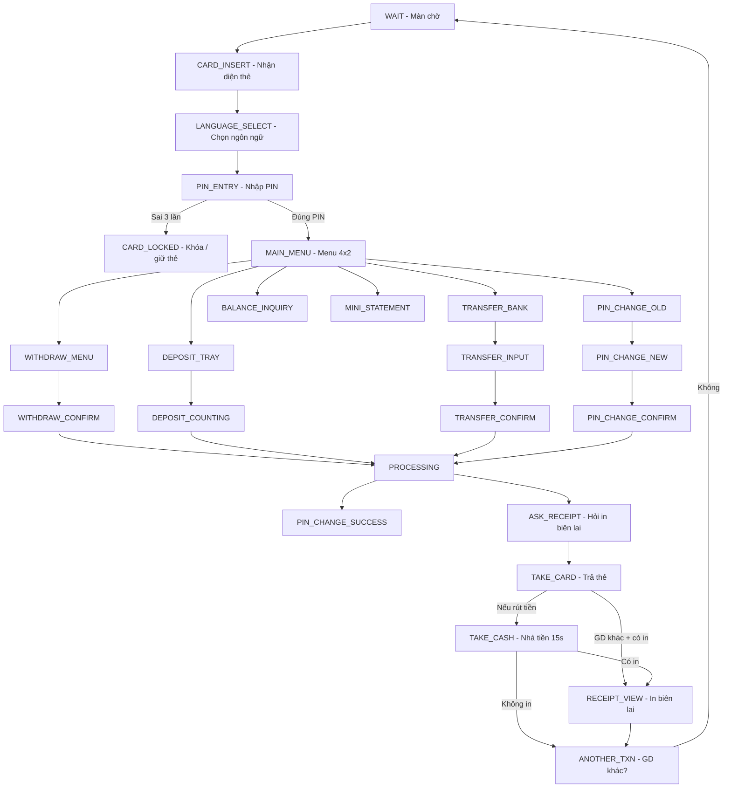

# Sơ đồ Luồng Trạng thái ViTM (`ATMState`)

```mermaid
flowchart TD
    WAIT[WAIT - Màn chờ] --> CARD_INSERT[CARD_INSERT - Nhận diện thẻ]
    CARD_INSERT --> LANGUAGE_SELECT[LANGUAGE_SELECT - Chọn ngôn ngữ]
    LANGUAGE_SELECT --> PIN_ENTRY[PIN_ENTRY - Nhập PIN]
    PIN_ENTRY -->|Sai 3 lần| CARD_LOCKED[CARD_LOCKED - Khóa / giữ thẻ]
    PIN_ENTRY -->|Đúng PIN| MAIN_MENU[MAIN_MENU - Menu 4x2]

    MAIN_MENU --> WITHDRAW_MENU --> WITHDRAW_CONFIRM --> PROCESSING
    MAIN_MENU --> DEPOSIT_TRAY --> DEPOSIT_COUNTING --> PROCESSING
    MAIN_MENU --> TRANSFER_BANK --> TRANSFER_INPUT --> TRANSFER_CONFIRM --> PROCESSING
    MAIN_MENU --> PIN_CHANGE_OLD --> PIN_CHANGE_NEW --> PIN_CHANGE_CONFIRM --> PROCESSING --> PIN_CHANGE_SUCCESS
    MAIN_MENU --> BALANCE_INQUIRY
    MAIN_MENU --> MINI_STATEMENT

    PROCESSING --> ASK_RECEIPT[ASK_RECEIPT - Hỏi in biên lai]
    ASK_RECEIPT --> TAKE_CARD[TAKE_CARD - Trả thẻ]
    TAKE_CARD -->|Nếu rút tiền| TAKE_CASH[TAKE_CASH - Nhả tiền 15s]
    TAKE_CARD -->|GD khác + có in| RECEIPT_VIEW[RECEIPT_VIEW - In biên lai]
    TAKE_CASH -->|Có in| RECEIPT_VIEW
    TAKE_CASH -->|Không in| ANOTHER_TXN[ANOTHER_TXN - GD khác?]
    RECEIPT_VIEW --> ANOTHER_TXN
    ANOTHER_TXN -->|Không| WAIT
```
